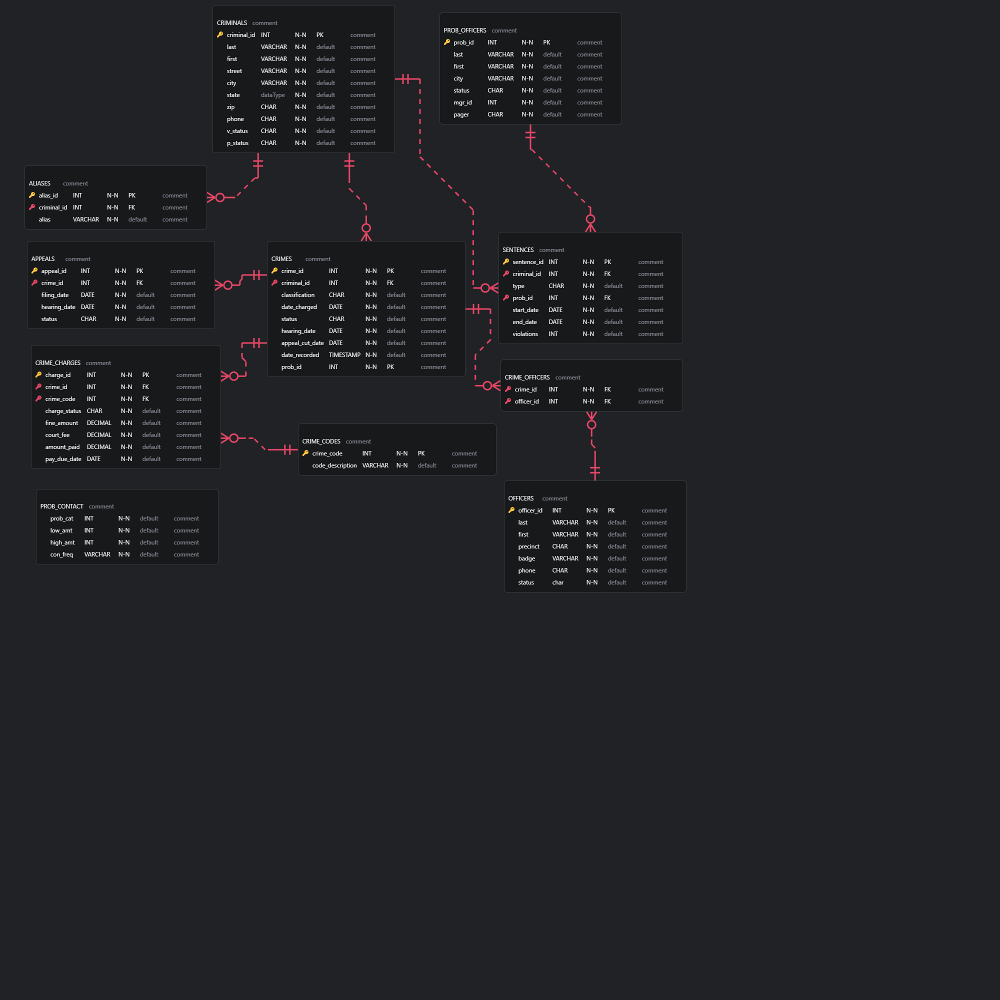

[README.md](https://github.com/user-attachments/files/26258085/README.md)
# City Jail Database


A relational database project built for **CSC4710 — Database Management Systems** (Winter 2023). The project models a city jail system covering criminals, crimes, officers, sentences, probation, and court appeals.

> 📋 **New to this repo?** See [GITHUB_SETUP.md](GITHUB_SETUP.md) for step-by-step instructions on repository name, topics, branch protection, and how to push.

---

## Project overview

The database was originally written for **Oracle SQL** and adapted to **MySQL** for local development. It covers two parts:

- **Part 1** — Schema design, table creation with constraints, and seed data insertion
- **Part 2** — Subquery-based analytical queries requested by a fictional Crime Analysis Unit

---

## ERD Diagram

The file `schema/jail_project.erd.json` is an ERD built with the [ERD Editor](https://marketplace.visualstudio.com/items?itemName=dineug.vuerd-vscode) extension for VS Code.

**To open it:**

1. Install the **ERD Editor** extension in VS Code (`dineug.vuerd-vscode`)
2. Open `schema/jail_project.erd.json` — it will render automatically as an interactive diagram



> **Note:** GitHub does not render `.json` ERD files natively. The file opens correctly in VS Code with the ERD Editor extension. If you want a viewable version on GitHub itself, see the [docs folder](docs/) which contains the original assignment PDFs with the schema description.

### Schema overview

```
CRIMINALS ──< ALIASES
CRIMINALS ──< CRIMES ──< CRIME_CHARGES >── CRIME_CODES
                    └──< CRIME_OFFICERS >── OFFICERS
                    └──< APPEALS
CRIMINALS ──< SENTENCES >── PROB_OFFICERS
PROB_CONTACT  (standalone lookup)
```

---

## Database schema

The database contains 11 tables across four logical groups:

**Core entities**

- `criminals` — primary subject table; all other records trace back here
- `aliases` — alternative names per criminal
- `officers` — law enforcement officers
- `prob_officers` — probation officers (self-referencing via `mgr_id`)

**Transactions**

- `crimes` — each charge filed against a criminal
- `sentences` — sentence details (jail `J`, house arrest `H`, probation `P`)
- `appeals` — appeal records per crime
- `crime_charges` — detailed charge records with fines and fees

**Junction tables**

- `crime_officers` — many-to-many link between crimes and officers

**Reference / lookup**

- `crime_codes` — code descriptions (e.g. 301 = Agg Assault)
- `prob_contact` — contact frequency schedule based on violation count

---

## Constraints and business rules

| Table           | Key constraints                                                               |
| --------------- | ----------------------------------------------------------------------------- |
| `criminals`     | `v_status` and `p_status` must be `'Y'` or `'N'`                              |
| `crimes`        | `classification` in `('F','M','O','U')` — Felony, Misdemeanor, Other, Unknown |
| `crimes`        | `status` in `('CL','CA','IA')` — Closed, Appealed, Inactive                   |
| `sentences`     | `type` in `('J','H','P')` — Jail, House arrest, Probation                     |
| `appeals`       | `status` in `('P','A','D')` — Pending, Accepted, Denied                       |
| `crime_charges` | `charge_status` in `('PD','GL','NG')` — Pending, Guilty, Not Guilty           |
| `prob_officers` | `status` in `('A','I')` — Active, Inactive                                    |
| `officers`      | `status` in `('A','I')` — Active, Inactive                                    |

---

## Oracle → MySQL adaptations

The original assignment used Oracle SQL syntax. The following changes were made for MySQL compatibility:

| Oracle                     | MySQL equivalent used             |
| -------------------------- | --------------------------------- |
| `NUMBER(n)`                | `INT`                             |
| `VARCHAR2(n)`              | `VARCHAR(n)`                      |
| `DEFAULT SYSDATE`          | `DEFAULT CURRENT_TIMESTAMP`       |
| `MODIFY (col DEFAULT val)` | `MODIFY col TYPE DEFAULT val`     |
| `SEQUENCE`                 | Not needed; IDs inserted manually |
| `ADD (col ...)`            | `ADD COLUMN col ...`              |

---

## Getting started

### Requirements

- MySQL 8.0 or later
- MySQL CLI or a GUI such as MySQL Workbench / DBeaver
- VS Code + [ERD Editor extension](https://marketplace.visualstudio.com/items?itemName=dineug.vuerd-vscode) to view the diagram

### Setup

```bash
# 1. Clone the repository
git clone https://github.com/<your-username>/city-jail-db.git
cd city-jail-db

# 2. Create the schema and tables
mysql -u root -p < sql/01_schema.sql

# 3. Insert seed data
mysql -u root -p < sql/02_seed_data.sql

# 4. (Optional) Run the assignment queries
mysql -u root -p city_jail < queries/assignment_queries.sql
```

Or run interactively:

```sql
SOURCE sql/01_schema.sql;
SOURCE sql/02_seed_data.sql;
```

---

## Assignment queries (Part 2)

All queries are in `queries/assignment_queries.sql`. Each one uses a subquery as required by the assignment.

| Query   | Description                                                     |
| ------- | --------------------------------------------------------------- |
| Q1 / Q6 | Officers who reported more crimes than the average              |
| Q2 / Q7 | Non-violent criminals with fewer crimes than average            |
| Q3 / Q8 | Appeals with fewer days between filing and hearing than average |
| Q4      | Probation officers with fewer assigned criminals than average   |
| Q5      | Crime(s) with the most appeals on record                        |
| Q9      | Alphabetical criminal list with aliases (LEFT OUTER JOIN)       |
| Q10     | Full `SELECT *` dumps of all tables                             |

---

## Repository structure

```
city-jail-db/
├── schema/
│   └── jail_project_erd.json          # ERD file — open with ERD Editor in VS Code
|   └── jail_project_erd.png         # ERD file - Image preview
├── sql/
│   ├── 01_schema.sql                  # CREATE TABLE statements + constraints
│   └── 02_seed_data.sql               # INSERT statements (all sample data)
├── queries/
│   └── assignment_queries.sql         # Part 2 subquery answers
├── docs/
│   ├── City-Jail-Database-Class-Project-Winter-2023.pdf
│   ├── City-jail-assignment-2023.pdf
│   └── City-jail-assignment-2023_FakhruldinL.docx
├── .gitignore
└── GITHUB_SETUP.md
└── README.md
```

---

_Course: CSC4710 — Database Management Systems, Winter 2023_
